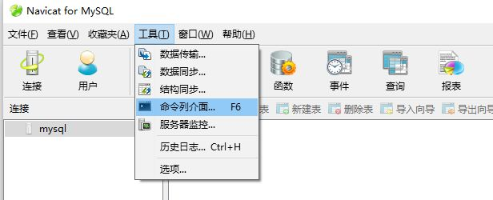

## MySQL表建立
表按照如图导入CDC_MySQL.sql



## 开发包
* 开发包目录为CDC_MySQL_dev，包含两个头文件和一个so库，分别为：CDC_MySQL.h、CppMySQL.h和libCDC_MySQL.so

以CDC_User.h举例，json接口为：
```
    std::string CDC_User_add(const std::string& req);
	std::string CDC_User_del(const std::string& req);
	std::string CDC_User_update(const std::string& req);
	std::string CDC_User_find(const std::string& req);
	std::string CDC_User_FindCount(const std::string& req);
```

## 使用方法
* 请参考开发包目录为CDC_MySQL_dev中的samplete程序：test_dev.cpp
* 注意：因为mysql操作句柄只有一个，因此要保证CppMySQLDB对象只有一个，new多个CppMySQLDB对象可能会发生未知的错误。
* 单元测试程序以及samplete程序中的，数据库Host、USER、PASSWORD需要根据实际情况修改。

## 单元测试程序运行
测试程序为bin/Tests,运行依赖libCDC_MySQL.so和libCppUnit.so
请将lib中的libCDC_MySQL.so和libCppUnit.so拷贝到bin文件夹
然后执行 ./Tests -all

## 安装
* 首先安装mysql及mysql开发包
- 先安装mysql
- 代码:
-sudo apt-get install mysql-server mysql-client

- 再装开发包
- 代码:
- sudo apt-get install libmysqlclient*-dev

* 给脚本增加可执行权限：
```
chmod +x install_and_compile.sh
./install_and_compile.sh
```

##直接编译 
chmod +x compile.sh
./compile.sh

##类库封装
* 类库以so文件的方式生成，所需头文件在include目录下
* include/MySQL5.7为mysql需要的头文件
* include/CppUnit为单元测试需要的头文件
* lib目标程序为lib/libCDC_MySQL.so


## 测试程序
* 测试程序为bin/Tests
* 使用方法 ./Tests -all
